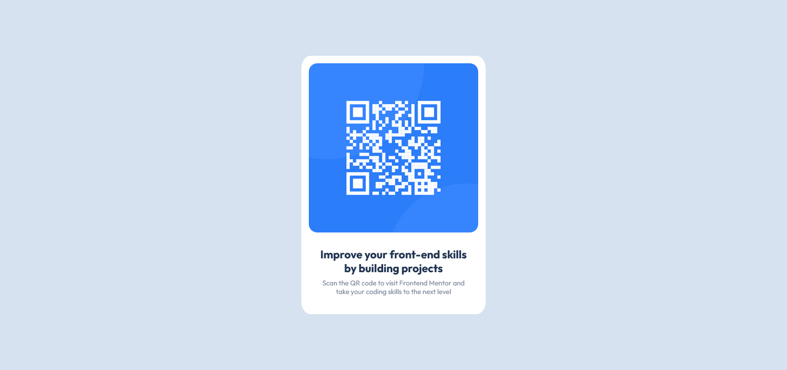

# Frontend Mentor - QR code component solution

## Overview

This is a solution to the [QR code component challenge on Frontend Mentor](https://www.frontendmentor.io/challenges/qr-code-component-iux_sIO_H). Frontend Mentor challenges help you improve your coding skills by building realistic projects.

### Screenshot

### Links

- Solution URL: [https://github.com/luizlevindiniz/qrCode-Frontend-Mentor](https://github.com/luizlevindiniz/qrCode-Frontend-Mentor)
- Live Site URL: [https://qr-code-frontend-mentor-xi.vercel.app/](https://qr-code-frontend-mentor-xi.vercel.app/)

## My process

### Built with

- Semantic HTML5
- CSS
- Flexbox
- Media queries

### What I’ve learned

My main takeaway from this project was learning how to use flexbox and media queries properly, in order to create a responsive layout for desktop (default: 1400x800) and mobile (default: 375x667).

### Continued development

Since I am just a beginner in programming (overall), I’m focusing my studies in web development. My goal is to master as much HTML, CSS, JS and Typescript as possible because I think that building strong fundamentals come before mastering frameworks.

## Author

- Frontend Mentor - @luizlevindiniz
